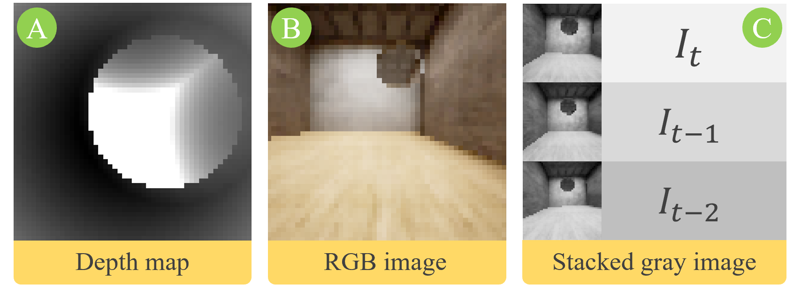
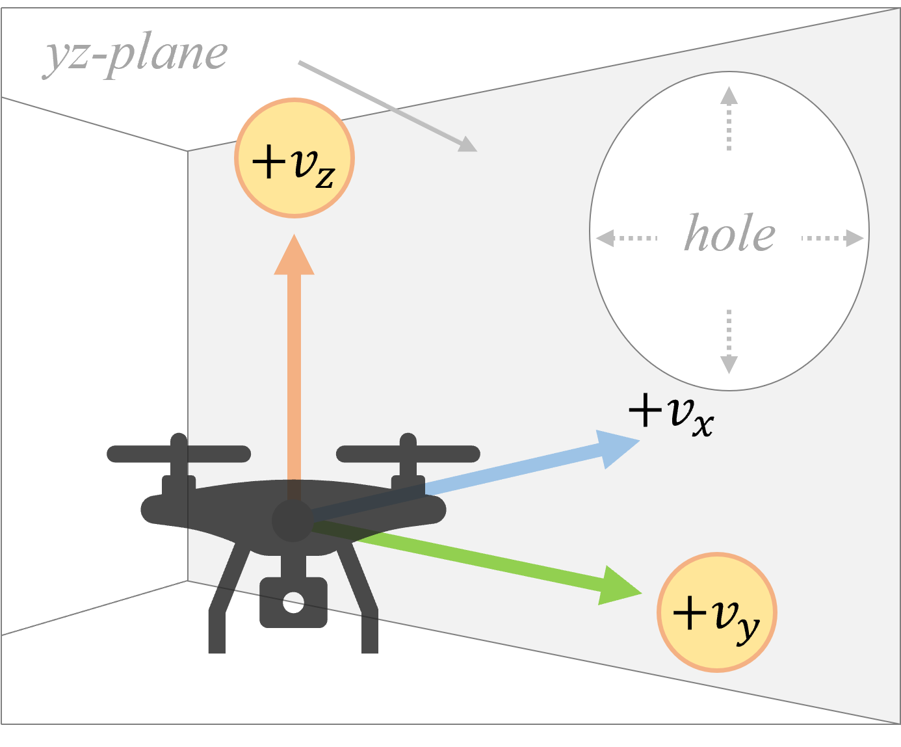
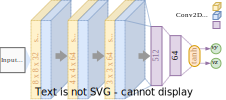

## This repository is inspired by work of Bilal Kabas on PPO based motion planning. We have extended this work with implementation of several RL algorithms and compared results.

# DRL-Nav: Autonomous UAV Navigation via Deep Reinforcement Learning Using PPO

> ℹ️ This work is an extension of [Original Repository by Bilal Kabas](https://github.com/bilalkabas/PPO-based-Autonomous-Navigation-for-Quadcopters): "PPO-based Autonomous Navigation for Quadcopters". 

This repository contains an implementation of PPO, SAC, DQN and DDPG for autonomous navigation in a corridor environment with a quadcopter. There are blocks having circular opening for the drone to go through for each 4 meters. The goal is that the agent navigates through these openings without colliding with blocks. The train and test environments were created using Unreal Engine and Microsoft AirSim. **This project currently runs only on Windows since Unreal environments were packaged for Windows.**

## Contents

  - [Overview](#overview)
    - [Inputs](#inputs)
    - [Actions](#actions)
    - [Neural Network](#neural-network)
  - [Results](#results)

## Overview

The training environment has 15 sections with different textures and hole positions. The agent starts at these sections randomly. The starting point of the agent is also random within a specific region in the yz-plane.

### Inputs
There are three models trained using depth, single RGB, and stacked gray images, respectively. Their sizes are as follows

- **Depth map:** 50 x 50 x 1
- **Single RGB image:** 50 x 50 x 3
- **Depth image:** 50 x 150 x 1

  

### Actions
There are two actions:

  

### Neural Network
In this work, a five layer neural network is used.

  

  

## Environment setup to run the codes can be found in original repository [link](https://github.com/bilalkabas/DRL-Nav).

## Results

The test environment has different textures and hole positions than that of the training environment.
This is the drive link for results.[link](https://drive.google.com/drive/u/0/folders/1cs6wVKMGuNmjVfDT7s6s3D0KgJ-0KTek)

We have compared performance of different RL algorithms, where we have traveresed quadrotor through 5 different holes in the wall and comapred flying distance. Below are the algorithm comparison results.

### Path length Comparison
Table  – Flight Distance and Success Rate based on each Model
| Model | Flight Distance (m) | Success Rate (Over 100 test episodes) |
| ------ | ------ | ------ |
| PPO with NatureNet | 22.90 m | 69 % | 
| PPO with BasicNet | 20.30 m | 89 % |
| DDPG with NatureNet | 0 m | 0 % |
| DDPG with BasicNet | 0 m | 0 % |
| DQN with NatureNet | 20.11 m | 89 % |
| DQN with BasicNet | 21.85 m | 84 % |
| A2C with NatureNet | 0 m | 0 % |
| A2C with BasicNet | 0 m | 0 % |
| PPO with BasicNet, 5 image stack, Updated reward function, Different Action Space | 20.07 m | 98 % |

